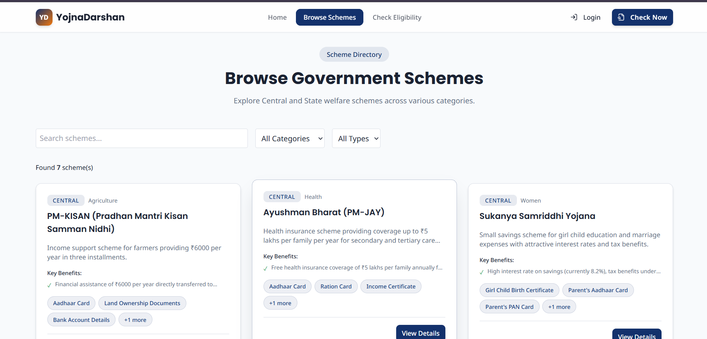

# YojnaDarshan – Government Scheme Eligibility Platform

YojnaDarshanis a full-stack government welfare platform that helps users discover eligible Central and State schemes using a rule-based eligibility engine.

Built during InnovIT Hackathon 🏆

---

## 🚀 Features

- Smart government scheme eligibility checker
- Rule-based filtering using age, income, category, occupation, and state
- Modern responsive UI with animations
- Admin dashboard for managing schemes
- User authentication UI
- Dynamic scheme search & category filtering
- Central and State government schemes support
- FastAPI backend with SQLite database
- REST API based architecture

---

## 🛠️ Tech Stack

### Frontend
- React
- TypeScript
- Tailwind CSS
- Framer Motion
- shadcn/ui

### Backend
- FastAPI
- SQLite
- SQLAlchemy
- Pydantic

---

## 📸 Screenshots
### Home Page


### Features Section


### Eligibility Checker


### Final Result Page

---

## ⚙️ Installation

### Clone Repository

```bash
git clone <YOUR_GITHUB_REPO_URL>
cd <PROJECT_FOLDER_NAME>
```

---

## Frontend Setup

```bash
npm install
npm run dev
```

Frontend runs on:
```bash
http://localhost:5173
```

---

## Backend Setup

```bash
cd backend

pip install fastapi uvicorn sqlalchemy pydantic python-dotenv

uvicorn server:app --reload
```

Backend runs on:
```bash
http://localhost:8000
```

API Docs:
```bash
http://localhost:8000/docs
```

---

## 📂 Project Structure

```bash
frontend/
│── src/
│── components/
│── pages/
│── services/

backend/
│── app/
│   ├── api/
│   ├── models/
│   ├── schemas/
│   ├── services/
│   └── core/
```

---

## 🎯 Future Improvements

- Real authentication system (JWT)
- Email/SMS notifications for new schemes
- AI-powered recommendation engine
- PostgreSQL integration
- Multi-language support
- Admin analytics dashboard

---

## 🏆 Achievement

🥈 Runner-Up at InnovIT Hackathon

---

## 👨‍💻 Author

Team diamond
